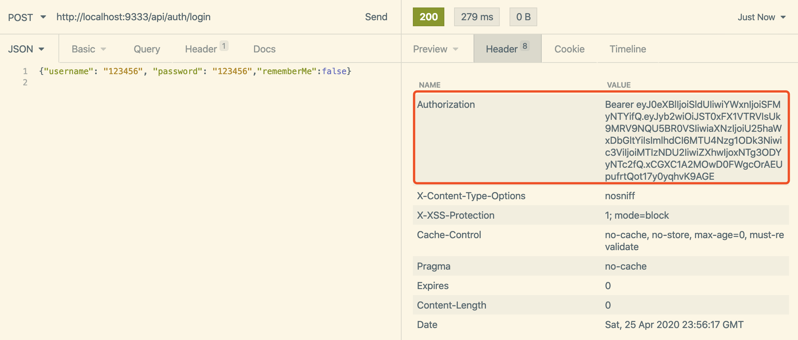
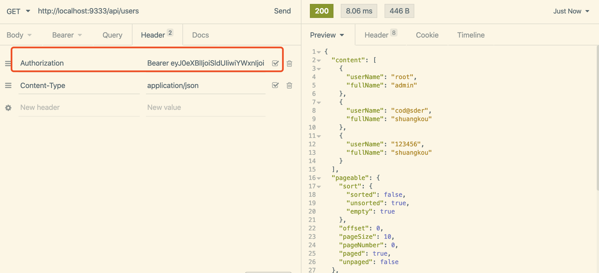

# spring-security-jwt-guide

[English version](https://github.com/Snailclimb/spring-security-jwt-guide/blob/master/README-ENGLISH.md)

**如果国内访问缓慢的话，可以通过码云查看：** https://gitee.com/SnailClimb/spring-security-jwt-guide 。


## 相关文档

- [JWT 优缺点分析以及常见问题解决方案](https://github.com/Snailclimb/JavaGuide/blob/master/docs/system-design/authority-certification/JWT-advantages-and-disadvantages.md)
- [项目讲解/分析](./docs/SpringSecurity介绍.md)

## 介绍

[Spring Security](https://spring.io/projects/spring-security ) 是 Spring 全家桶中非常强大的一个用来做身份验证以及权限控制的框架，我们可以轻松地扩展它来满足我们当前系统安全性这方面的需求。

但是 Spring Security 相比于其他一些技术比如 JPA 来说更难上手，很多人初学的时候很难通过看视频或者文档发就很快能独立写一个 Demo 出来，于是后面可能就放弃了学习这个东西。

刚来公司的时候的入职培训实战项目以及现在正在做的项目都用到了 Spring Security 这个强大的安全验证框架，可以看出这个框架在身份验证以及权限验证领域可以说应该是比较不错的选择。由于之前经历项目的这部分模块都不是自己做的，所以对于 Spring Security 并不是太熟悉。于是自/己抽时间对这部分知识学习了一下，并实现了一个简单的 Demo 。这个 Demo 主要用到了 **Spring Security** 和 **Spring Boot** 这两门技术，并且所有的依赖采用的都是最新的稳定版本。初次之外，这个项目还用到了 JPA 这门技术。项目代码结构如下(chrome 插件：Octoree)，整体还是比较清晰的，由于自己的能力以及时间有限，所以一定还有很多可以优化的地方，有兴趣的朋友可以一起完善，期待你的 PR。


## 你能学习到什么

1. Spring Security +JWT 实现登入登出以及权限校验
2. JPA 实现审计功能、多对多的映射关系如何通过关联表实现

## 如何运行项目

1. git clone https://github.com/Snailclimb/spring-security-jwt-guide.git
2. 打开项目并且等待 Maven 下载好相关依赖。建议使用 Intellij IDEA 打开，并确保你的 Intellij IDEA 下载了 lombok 插件。
4. 运行项目（相关数据表会被自动创建，不了解的看一下 JPA）

## 示例

### 1.注册一个账号

**URL:**

`POST http://localhost:9333/api/users/sign-up`

**RequestBody:**

```json
{"userName":"123456","fullName":"shuangkou","password":"123456"}

```


新注册的用户默认绑定的角色为：用户（USER）和管理者（MANAGER）。

### 2.登录

**URL:**

`POST http://localhost:9333/api/auth/login`

**RequestBody:**

```json
{"username": "123456", "password": "123456","rememberMe":true}
```




### 3.使用正确 Token 访问需要进行身份验证的资源

我们使用 GET 请求访问 `/api/users`，这个接口的访问权限是

```java
@PreAuthorize("hasAnyRole('ROLE_USER','ROLE_MANAGER','ROLE_ADMIN')")
```



### 4.不带 Token 或者使用无效 Token 访问

我们使用 GET 请求访问 `/api/users`，但是不带token或者带上无效token。


### 5.带了正确Token但是访问权限

我们使用 DELETE 请求访问 `/api/users?username=xxx`，携带有效的 token ，但是 token 的访问权限不够。


## 参考

- https://dev.to/keysh/spring-security-with-jwt-3j76
